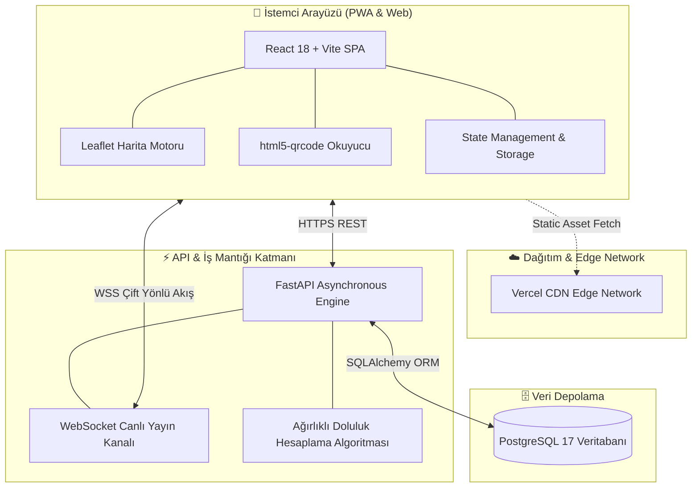

# 📍 YerBul — Fırat Üniversitesi Kampüs Radar
### Kitle Kaynaklı (Crowdsourced) Akıllı Kampüs ve Mekan Doluluk Radarı

[-red?style=flat-square)](LICENSE)

 

> 🚀 **[Canlı Uygulamayı Dene: yer-bul.vercel.app](https://yer-bul.vercel.app)**  
> *Bu depo, YerBul projesinin mimari yapısını, arayüz tasarımını ve özelliklerini sergilemek amacıyla hazırlanmış resmi vitrindir (Showcase).*

---

## 💡 Problem ve Çözüm

Özellikle vize ve final dönemlerinde Fırat Üniversitesi Merkez Kütüphanesi, fakülte çalışma salonları veya kampüs çevresindeki kafelerde yer bulmak ciddi bir zaman ve motivasyon kaybına yol açar. Öğrenciler kapı kapı dolaşarak boş masa aramak zorunda kalır.

**YerBul**, bu problemi kitle kaynaklı (crowdsourcing) gerçek zamanlı veri akışıyla çözer:
- Öğrenciler masalardaki QR kodları okutarak veya harita üzerinden tek tıkla doluluk durumunu bildirir.
- Sistem; anlık doluluk oranını (%0 - %100), dinamik açık/kapalı durumunu, priz/sessizlik imkanlarını ve kullanıcı yorumlarını canlı bir kampüs haritasında birleştirir.

---

## 📸 Arayüz Vitrini

| 🗺️ Canlı Harita & Radar | 📊 Mekan Detay & Canlı Bildirim |
| :---: | :---: |
|  |  |

| 📱 Masa QR ile Hızlı Bildirim | ⚙️ Sürükle-Bırak Yönetim Paneli |
| :---: | :---: |
|  |  |

*(Ekran görüntüleri `screenshots/` dizininden yüklenmektedir)*

---

## ✨ Öne Çıkan Özellikler

- 📍 **İnteraktif Kampüs Haritası:** Leaflet tabanlı, Fırat Üniversitesi Ana Kampüsü, Çaydaçıra, Malatya Caddesi ve KYK yurtlarını kapsayan 22+ doğrulanmış mekan.
- ⚡ **Anlık Kitle Kaynaklı Doluluk:** Öğrencilerin 4 kademeli anlık bildirimleri (*Boş, Müsait, Az Kaldı, Dolu*) ile otomatik hesaplanan ağırlıklı doluluk indeksi.
- 📷 **Masa QR Kodu ile Hızlı Bildirim:** Kamera erişimiyle masadaki QR kodu tarayarak saniyeler içinde oylama yapabilme.
- 🕒 **Dinamik Çalışma Saatleri:** Saate ve haftanın gününe göre otomatik güncellenen canlı `Açık` / `Kapalı` rozetleri.
- 🌙 **Gece Kuşu Modu:** Sınav haftalarında gece 00:00'dan sonra ve 7/24 açık olan çalışma mekanlarını tek tıkla filtreleme.
- ⭐ **Favorilerim & Yer İmleri:** Sık ziyaret edilen mekanları hızlı takip listesine kaydetme.
- 🎛️ **Görsel Admin Paneli:** Harita üzerinde pinleri sürükleyip bırakarak mekan konumlarını güncelleme ve yeni çalışma alanı ekleme.
- 🖨️ **Yazdırılabilir Masa QR Kartları:** Masalara yapıştırılmak üzere otomatik A4/kartvizit formatında çıktı üretme.

---

## 🏛️ Sistem Mimarisi

Uygulama, yüksek performanslı bir SPA frontend ve asenkron mikro-servis mimarisine sahip backend üzerinden haberleşir:

---

## 🛠️ Teknoloji Yığını

| Katman | Teknolojiler | Kullanım Amacı |
| :--- | :--- | :--- |
| **Frontend** | React 18, Vite | Hızlı, reaktif ve modern bileşen tabanlı SPA |
| **Harita & Konum** | Leaflet, React-Leaflet | Hafif, interaktif ve özel pinli kampüs haritası |
| **Arayüz & Animasyon** | CSS3 (Modern Light Theme), Framer Motion, Ionicons | Fırat Üniversitesi kurumsal bordo (`#6d131f`) açık tema |
| **Donanım Erişimi** | html5-qrcode, Camera API (`capture="environment"`) | Masalardaki QR kodları mobil tarayıcıdan anında okuma |
| **Backend API** | Python 3.11, FastAPI, Uvicorn | Asenkron yüksek performanslı REST API |
| **Canlı Veri** | WebSockets | Durum bildirimlerinin haritada anında yenilenmesi |
| **Veritabanı** | PostgreSQL 17, SQLAlchemy | Mekan bilgileri, çalışma saatleri ve bildirim geçmişi |
| **Deployment** | Vercel (Frontend), Render / Railway (Backend API) | Kesintisiz bulut barındırma ve global CDN |

---

## 🎨 Tasarım Sistemi & Kurumsal Kimlik

Uygulama, Fırat Üniversitesi'nin resmi kurumsal renk paletiyle geliştirilmiştir:
- **Resmi Bordo (`#6d131f`):** Kurumsal ana vurgu rengi
- **Antrasit (`#212327`):** Başlıklar ve kontrast arayüz elemanları
- **Altın Sarısı (`#f9bf3b`):** Priz, Wi-Fi ve favori rozetleri
- **Açık Arka Plan (`#ffffff` / `#f8fafc`):** Ferah, göz yormayan modern açık tema (Light Mode)

---

## 🔒 Telif Hakkı ve Fikri Mülkiyet Bildirimi

> ⚠️ **Telif Hakkı (c) 2026 Baran Tunca. Tüm Hakları Saklıdır.**
>
> Bu depo, **YerBul** projesinin portfolyo ve mimari vitrini olarak kamuya açık tutulmaktadır. Projenin kaynak kodları, veri tabanı mimarisi, tescilli algoritmaları ve iş mantığı özel mülkiyettir.
>
> Yazılı izin alınmaksızın bu projenin ticari olarak kullanılması, kısmen veya tamamen kopyalanması, çoğaltılması veya kaynak kodlarının tersine mühendislik ile çözümlenmesi kesinlikle yasaktır.

---

## 👤 Geliştirici & İletişim

**Baran Tunca**  
*Fırat Üniversitesi*

- 🌐 **Canlı Uygulama:** [yer-bul.vercel.app](https://yer-bul.vercel.app)
- 💼 **LinkedIn:** [linkedin.com/in/baran-tunca](https://www.linkedin.com/in/baran-tunca/)
- 🐙 **GitHub:** [@barantunca](https://github.com/barantunca)
- ✉️ **E-Posta:** [barantunca25@gmail.com](mailto:barantunca25@gmail.com)
