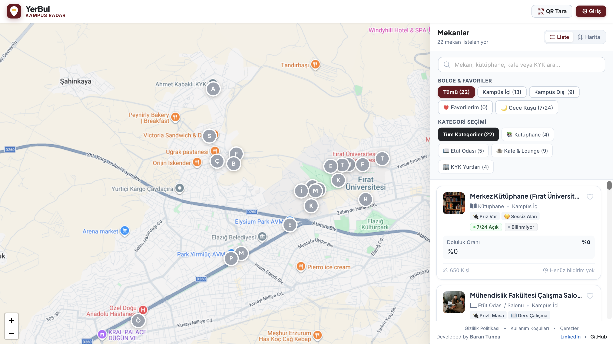
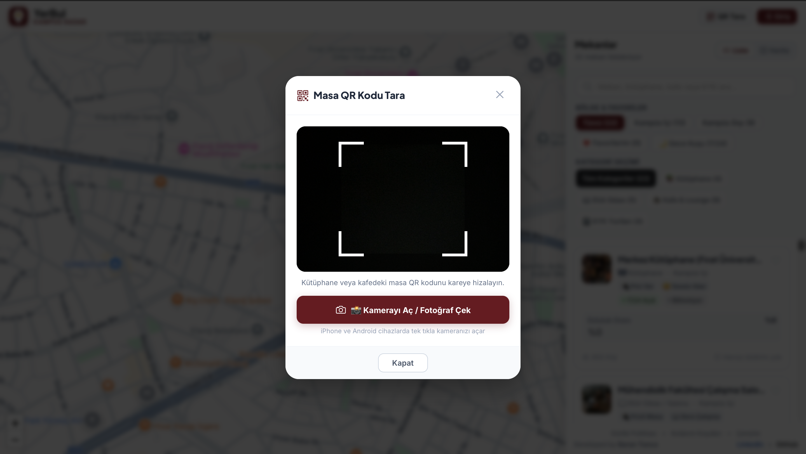

# 📍 YerBul — Fırat Üniversitesi Kampüs Radar
### Kitle Kaynaklı (Crowdsourced) Akıllı Kampüs Doluluk Radarı

[-red?style=flat-square)](LICENSE)

 

**Fırat Üniversitesi kampüsündeki kütüphaneler, etüt salonları, kafeler ve dinlenme alanlarının anlık doluluk durumunu canlı harita üzerinden takip etmeyi sağlayan web uygulaması.**

[🚀 Canlı Uygulamayı Dene](https://yer-bul.vercel.app) • [✨ Özellikler](#-özellikler) • [🛠️ Teknolojiler](#️-teknolojiler) • [👤 İletişim](#-iletişim)

---

## 📸 Arayüz Vitrini

| 🗺️ Kampüs Haritası | 📊 Mekan Detay & Doluluk | 📱 QR ile Hızlı Bildirim |
| :---: | :---: | :---: |
|  |  |  |

---

## 💡 Proje Hakkında

Sınav dönemlerinde kütüphane ve çalışma salonlarında yer bulamayıp geri dönmek ya da ders aralarında boş kafe aramak öğrenci hayatının en büyük vakit kayıplarından biridir.

**YerBul**, bu problemi kitle kaynaklı (crowdsourced) gerçek zamanlı veri akışıyla çözer. Öğrenciler masalardaki QR kodları okutarak veya harita üzerinden tek tıkla doluluk durumunu bildirir; sistem anlık doluluk oranını (%0 - %100), açık/kapalı durumunu ve çalışma imkanlarını haritada birleştirir.

---

## ✨ Özellikler

- 📍 **İnteraktif Kampüs Haritası:** Ana Kampüs, Çaydaçıra, Malatya Caddesi ve KYK yurtlarını kapsayan 22+ doğrulanmış mekan.
- ⚡ **Kitle Kaynaklı Canlı Doluluk:** Öğrencilerin anlık bildirimleri (*Boş, Müsait, Az Kaldı, Dolu*) ile otomatik hesaplanan doluluk yüzdeleri.
- 📷 **Masa QR Kodu ile Bildirim:** Telefon kamerasından masadaki QR kodu okutarak saniyeler içinde durum bildirme.
- 🕒 **Canlı Çalışma Saatleri:** Saate göre otomatik hesaplanan dinamik `Açık` / `Kapalı` rozetleri.
- 🌙 **Gece Kuşu Modu:** 00:00'dan sonra ve 7/24 açık olan çalışma mekanlarını tek tıkla filtreleme.
- ⭐ **Favori Mekanlar:** Sık kullanılan çalışma salonlarını yer imlerine ekleme.
- 🖨️ **Masa QR Kartları:** Masalara yapıştırılmak üzere çıktıya hazır QR kart şablonları.

---

## 🛠️ Teknolojiler

- **Frontend:** React 18, Vite, React-Leaflet, Framer Motion, html5-qrcode
- **Backend:** Python 3.11, FastAPI, SQLAlchemy, WebSockets
- **Veritabanı:** PostgreSQL
- **Dağıtım:** Vercel & Bulut Barındırma

---

## 🔒 Telif Hakkı & Gizlilik

> **© 2026 Baran Tunca. Tüm Hakları Saklıdır.**  
> Bu depo, projenin arayüz tasarımını ve özelliklerini sergilemek amacıyla hazırlanmış bir vitrindir (Showcase). Kaynak kodlar ve fikri mülkiyet hakları gizli tutulmaktadır; izinsiz kopyalanamaz veya ticari amaçla kullanılamaz.

---

## 👤 İletişim

**Baran Tunca** — Fırat Üniversitesi  
- 🌐 **Canlı Demo:** [yer-bul.vercel.app](https://yer-bul.vercel.app)
- 💼 **LinkedIn:** [linkedin.com/in/baran-tunca](https://www.linkedin.com/in/baran-tunca/)
- 🐙 **GitHub:** [@barantunca](https://github.com/barantunca)
- ✉️ **E-Posta:** [barantunca25@gmail.com](mailto:barantunca25@gmail.com)
